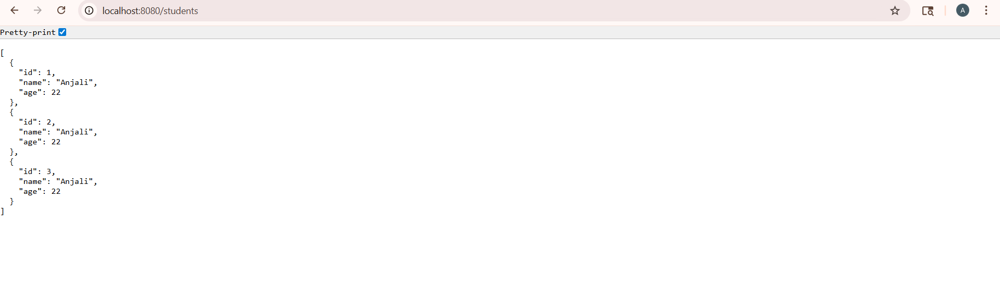

# 📘 Student Management System

* Spring Boot project to manage student data using REST APIs
* Uses H2 in-memory database with JPA
* Layered architecture: Controller → Service → Repository → Model
* Supports basic CRUD operations

---

# 📌 API Details

## ➕ Add Student

**Request:**

```json
{
  "name": "Anjali",
  "age": 22
}
```

**Response:**

```json
{
  "id": 1,
  "name": "Anjali",
  "age": 22
}
```

---

## 📄 Get All Students

**Request:**

```
GET /students
```

**Response:**

```json
[
  {
    "id": 1,
    "name": "Anjali",
    "age": 22
  }
]
```
http://localhost:8080/students




